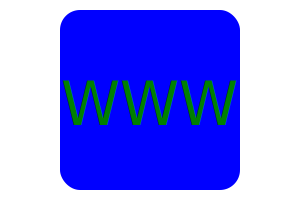

# SVG logo maker

## Description

This is a program that will help user to make a logo.

## Table of Contents
- [Installation](#installation)
- [Usage](#usage)
- [Screenshot](#screenshot)
- [Video recording](#video-recording)
- [Credits](#credits)
- [License](#license)
- [Badges](#badges)
- [Features](#features)
- [Contributing](#contributing)
- [Tests](#tests)
- [Email address](#email-address)
- [Github username](#github-username)

## Installation
On the node.js command prompt, run the command npm install to install the inquirer package which is a dependency for the program.

## Usage
To run the program, go to the node.js command prompt and run the command "npm index.js"

## Screenshot

Below is a screenshot of the application when ran using command line.

Below are example logos created by the program.

## Video recording
You can visit this link to view the application in action: https://drive.google.com/file/d/18WCgs6w14ByYFuz-DN4_RQJGec-tHw_X/view

## Credits
none

## License
n/a

## Badges

## Features
The program can generate logo with 4 different shapes: circle, square, ellipse and triangle.

## Contributing
n/a

## Tests
Jest is used for unit testing of the program. The tests are under the lib folder.

## Email address
allen.tuazon@gmail.com

## Github username
allentpogi

            